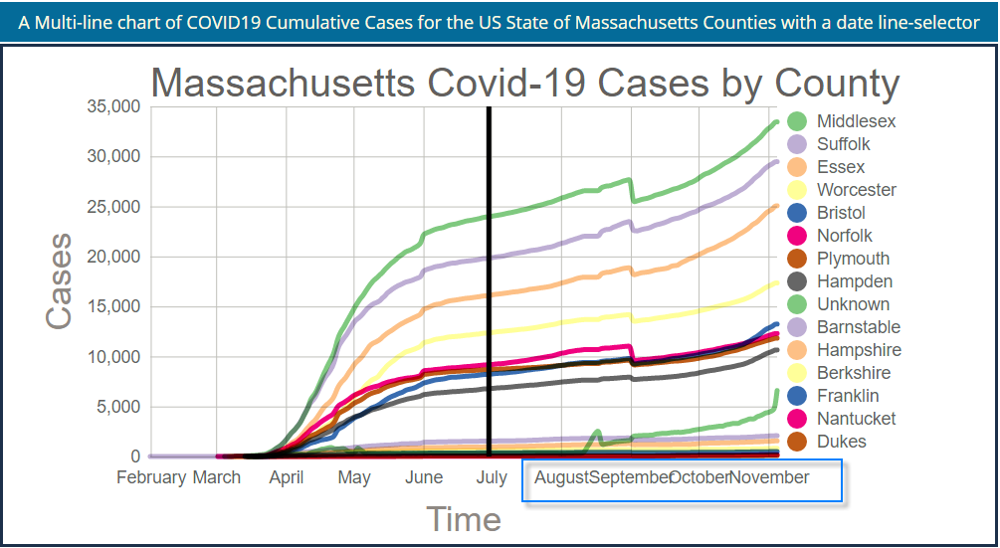
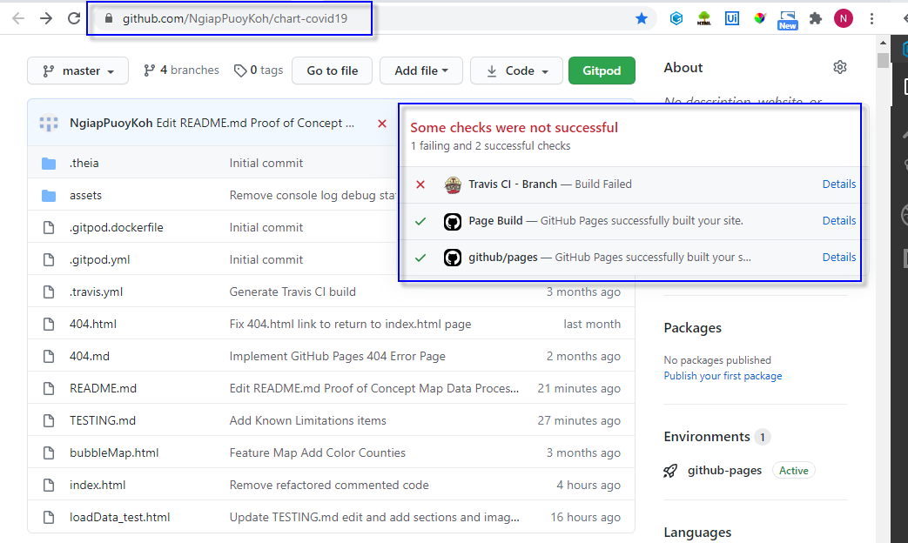

# Testing - Chart Covid19 Pandemic Cases

## Contents

- [Validators](#validators)
- [Unit Testing](#unit-testing)
- [Test Driven Development D3](#test-driven-development-d3)
- [Website Behavior on different Browsers and Screen Size](#website-behavior-on-different-browsers-and-screen-size)
- [End to End Testing](#end-to-end-testing)
  - [Functional User Stories Test Matrix](#functional-user-stories-test-matrix)
- [Bug Resolution](#bug-resolution)
- [Known Limitations](#known-limitations)
- [Integration Testing](#integration-testing)
  - [Automated Test Case using QUnit and Travis CI](#automated-test-case-using-qunit-and-travis-ci)
  - [Steps to execute and review automated test in Gitpod](#steps-to-execute-and-review-automated-test-in-gitpod)
  - [QUnit Travis CI GitHub Setup](#qunit-travis-ci-github-setup)

---

## Validators

### Javascript Validator

- [JSHint Configured for New JavaScript features (ES6)](https://jshint.com/)

### CSS

- [W3C CSS Validation Service](http://www.css-validator.org/)

- [Autoprefixer is a PostCSS plugin which parses your CSS and adds vendor prefixes](https://autoprefixer.github.io/)

### Accessibility

- WCAG Color contrast checker


- [Accessible color palette builder](https://toolness.github.io/accessible-color-matrix/)


- Chrome Dev Tool Lighthouse Accessibility Report
  

### Responsive Web Page

- [Ami Responsive Checker](http://ami.responsivedesign.is/)
  

### 404 Error Page with a link back to home page

- Validate that the 404 page link renders the home page when clicked
  

## Unit Testing

### Data Load Read Data test using Chrome Dev tool console.log

- Validate Data Elements and selected random records from the data source and validate data load promise object records


- Validate computed values domain required for scaling charts using D3

### Monitor Dynamic Data Process and Rendering

- Deployed the website to Git Pages and monitor changes in chart data daily to validate the data is updated as released by the data source
- Review data source notes for disruptions in the trends
  For example, [The Covid Tracking Project](https://covidtracking.com/data/state/massachusetts) reported that on September 2, 2020, MA reported that it had shifted to using the more restrictive August 6 definition of probable cases released by the CSTE.
  This change caused a significant decrease in several data points where probable cases or probable deaths were included, particularly the overall case count, which dropped by more than 7,000. Historical data was also affected.

## Test Driven Development D3

- Utilize console.log to display variable values using Dev tool when adding components and attributes
- Validate addition by rendering the webpage and inspecting to confirm expected outcome

## Website Behavior on different Browsers and Screen Size

- Website is developed to render using Firefox and Chrome
- CSS Grid not compatible with other browsers and older versions
- Columns will display side by side on screen sizes 600px and greater. Columns will be stacked for screen size less than 600px
- Chart are zoomable using browser zoom function utilizing built-in gestures available on mobile devices and browser settings on other devices
- Maps have interactive zoom and pan functions on all screen sizes

## End to End Testing

### Functional User Stories Test Matrix

| Test Case | User Story                                                                                                                        | Feature                                                                                           | Expected Result                                                                                                             | Actual Result                                                                                     |
| --------- | --------------------------------------------------------------------------------------------------------------------------------- | ------------------------------------------------------------------------------------------------- | --------------------------------------------------------------------------------------------------------------------------- | ------------------------------------------------------------------------------------------------- |
| 1         | As a user, I want to be notified of the latest counts number of COIVID19 cases as soon as the information becomes available       | Chart data updates when data is released                                                          | Line charts are updated with latest COVID counts by date                                                                    | Chart data updated as data is released daily                                                      |
| 2         | As a user, I want to review the trend of cases by counties during the COVID19 Pandemic                                            | Line Chart Legend                                                                                 | a line represents the county                                                                                                | The legend for the line chart provides the names of the counties                                  |
| 3         | As a user, I want to view counties sorted from highest to lowest number of cases                                                  | Line chart Legend for counties is sorted by the latest counts                                     | The lines in the chart legend are sorted base on the latest number of covid counts                                          | Sort order of the lines are by the latest covid counts                                            |
| 4         | As a user, I want to be able to select a specific date to report the number of cases by location                                  | Select a date on a line chart using a mouseover line for date selection                           | The tooltip renders data for the selected date                                                                              | A user can select the date using the line selector on the chart to set choropleth map information | Hover over different counties using the mouse and tooltip displays the information for the county |
| 5         | As a user, I want to be able to select a location and get the count of Covid19 cases                                              | User zoom and pan map and hover over any county to render covid counts                            | Zoom and pan functions are working and tooltip display county information by hovering the cursor over the county            | User can zoom and pan using the mouse on a computer and use hand gestures on mobile devices       |
| 6         | As a user, I want to be able to select a date and have it automatically synchronize with the data displayed on the choropleth map | The date is displayed on the map title dynamically and renders data for each county for that date | The date selected is displayed on the title of the map dynamically with the tooltip data for the counties are for that date |
| 7         | As a user, I want to be able to access the web using large screen devices                                                         | The page will display as three columns for the instructions section                               | The instruction section has three columns                                                                                   | The page will display as three columns for the instructions section
| 8         | As a user, I want to be able to access the web page using mobile devices                                                          | The page displays as a single column for all page sections                                        | The page displays as a single stacked column                                                                                | The page displays as a single column for all page sections

#### Test Case 1 Chart data updates when data is released

Chart data updated as data is released daily


#### Test Case 2 Line Chart Legend

Lines for all Counties Displayed with Legend


#### Test Case 3 Line chart Legend for counties is sorted by the latest counts

County Legend Sort Order by Latest CPVID19 Case


#### Test Case 4 Select a date on a line chart using a mouseover line for date selection

- User hovers over rectangle area to move line selector which renders tooltip for date
- User clicks to select the date
- Date selected will be captured in the Choropleth map title


#### Test Case 5 User zoom and pan map and hover over any county to render covid counts

- User is able to zoom, pan and hover cursor over a county on the map to render tooltip displaying the county's covid counts for the date selected

- Default Map displays counties all US Counties


- Zoom and Pan to Middlesex County in state of Massachusetts


#### Test Case 6 The date is displayed on the map title dynamically and renders data for each county for that date

- Validate hyperlinks to external pages for data source and data notes


#### Test Case 7 Responsive Web Page on a Large Screen Device

The page will display as three columns for the instructions section


#### Test Case 8 Responsive Web Page on a Mobile Device

The page displays as a single column for all page sections


## Bug Resolution

### Page Scrolling not enabled


Solution:

- Remove CSS attribute overflow: hidden for the HTML body element

```
body {
  margin: 0px;
  /* overflow: hidden; */
}
```

### Deployment on GitHub pages – 404 issues

Solution:

- Created a repo in GitHub and generated a Gitpod workspace without using the CI template
- Copied all my files from VSCode on my local machine to the Gitpod repo and pushed it to GitHub
- Enabled Github pages and everything rendered.

  Note: It appears it circumvented the file path issues and resolved the 404 unable to load resource issues

- [baseurl / base-url: GitHub Pages Project Pages - Relative Links Fail #332](https://github.com/jekyll/jekyll/issues/332#issuecomment-18952908)

### D3 SVG with CSS Grid not responsive

Unable to make D3 SVG responsive with CSS GRID
Resolved: SVG element needs width and height in conjunction with viewBox


Solution:

- Source Credit: D3 Slack Community post by Mike Lambert Sep 10th at 2:21 PM

In conjunction with viewBox, you need to have max-width: 100% and/or height: auto on your SVG

- Researched and attempted solutions
  - User Bootstrap Grid
  - Autoprefixer
  - Utilize SVG viewBox instead of SVG width and height
  - Applied CSS Autoprefixer

### D3 Line Chart Time Axis Tick Labels Overlapping

Labels for the months start to overlap as more data is released

Solution:  
 Use abbreviated month name format for time axis tick labels

```
const xAxis = d3.axisBottom(xScale).tickSize(-innerHeight).tickPadding(15).tickFormat(d3.timeFormat("%b"));
```




```
  width: -webkit-fit-content;
  width: -moz-fit-content;
  width: fit-content;
```

## Known Limitations and Issues

### Application Development

- x-axis tick labels will begin to collide with more data so that there is not sufficient space to accommodate the label length. A future fix is to display the tick labels at an angle and reduce the font size
- Rendering of the web page is slow
- Responsive media query is designed for below and above 600 px threshold. Smaller than 425 px thresholds are not ideal for interacting and rendering the chart and map
- The date displayed in the map title is dependent on the data source format type
- CSS Grid is known to have subtle issues with responsiveness on older devices and browsers that require separate styling and HTML page development for those devices and browsers. An example is the text content of the header section is responsive. However, there is no space for the right padding for the text item on small screens. The workaround is to rotate the device to view the page in landscape.

### Git

- Unresolved Git rebase issue for feature-branch while learning to use git branch for this project. I researched the issue and found solutions but not comfortable attempting a fix without messing up the working codebase that is working.
  CI Support was conulsted for assistance and receive the recommendation to submit the project without resolving the issue.
  "So git rebase is a really advanced git feature, which can throw some real spanner in the works. In general I don't think it's something that's very recommended. The assessors will take a look at all branches and all commits so there's no worry there regarding your commit history"
- Travis CI/CD is failing because of the unresolved Git rebase issue. The master branch is not affected.

## Integration Testing

### Automated Test Case using QUnit and Travis CI

#### [loadData.test.js](https://github.com/NgiapPuoyKoh/chart-covid19/blob/master/assets/js/loadData.test.js)

- Validate Data is read successfully from the data source

```
import { readData } from "./loadData.js";

// Test to validate data load has at least one row
QUnit.test("Test Data Read URL link to New York Times COVID19 Data", function (
  assert
) {
  let promise = readData();

  return promise.then((d) => {
    assert.ok(Boolean(d.length > 0), "Data Read");
  });
});
```

[Automated Test Results](assets/js/loadData_test.html)


### Steps to execute and review automated test in Gitpod

- Run python3 -m http.server
- Open Browser
- Modify URL add the following to the end
  ```
  /loadData_test.html
  ```
- Review the test Results

### QUnit Travis CI GitHub Setup

#### [loadData_test.html](https://github.com/NgiapPuoyKoh/chart-covid19/blob/master/loadData_test.html)

- Configure Qunit

```
    <div id="qunit"></div>
    <div id="qunit-fixture"></div>
    <!-- Load the QUnit Testing Framework from CDN - this is the important bit ... -->
    <script src="https://code.jquery.com/qunit/qunit-1.18.0.js"></script>
    <script type="module" src="assets/js/loadData.test.js"></script>
```

#### GitHub Travis CI Integration

- Github Travis Integration


